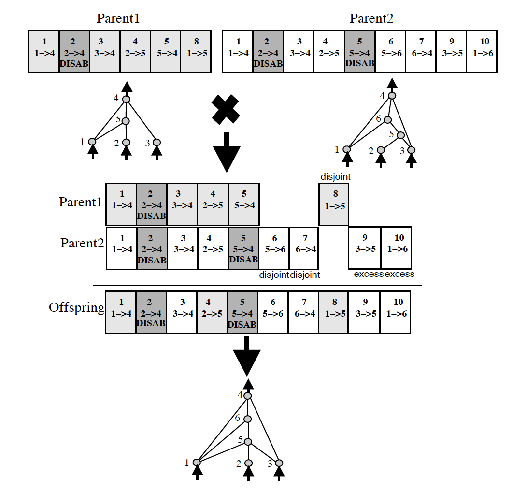

# NEAT-AI_Plays-Flappy-Bird
This in an implementation of NEAT to create an AI that plays the classic game of Flappy Bird.

## Flappy Bird
Flappy Bird is a side-scrolling mobile game featuring 2D retro style graphics. The objective is to direct a flying bird, named "Faby", who moves continuously to the right, between sets of Mario-like pipes. If the player touches the pipes, they lose. Faby briefly flaps upward each time that the player taps the screen; if the screen is not tapped, Faby falls because of gravity; each pair of pipes that he navigates between earns the player a single point, with medals awarded for the score at the end of the game. No medal is awarded to scores less than ten. A bronze medal is given to scores between ten and twenty. In order to receive the silver medal, the player must reach twenty points. The gold medal is given to those who score at least thirty points. Players who achieve a score of forty or higher receive a platinum medal. Android devices enabled the access of world leaderboards, through Google Play.

## Neuroevolution of Augmenting Topologies (NEAT)
NeuroEvolution of Augmenting Topologies (NEAT) is a genetic algorithm (GA) for the generation of evolving artificial neural networks (a neuroevolution technique) developed by Ken Stanley in 2002 while at The University of Texas at Austin. It alters both the weighting parameters and structures of networks, attempting to find a balance between the fitness of evolved solutions and their diversity. It is based on applying three key techniques: tracking genes with history markers to allow crossover among topologies, applying speciation (the evolution of species) to preserve innovations, and developing topologies incrementally from simple initial structures ("complexifying").

### NEAT Overview
NEAT (NeuroEvolution of Augmenting Topologies) is an evolutionary algorithm that creates artificial neural networks. For a detailed description of the algorithm, you should probably go read some of Stanley’s papers on his website.

Even if you just want to get the gist of the algorithm, reading at least a couple of the early NEAT papers is a good idea. Most of them are pretty short, and do a good job of explaining concepts (or at least pointing you to other references that will). The initial NEAT paper is only 6 pages long, and Section II should be enough if you just want a high-level overview.

In the current implementation of NEAT-Python, a population of individual genomes is maintained. Each genome contains two sets of genes that describe how to build an artificial neural network:

1. Node genes, each of which specifies a single neuron.
2. Connection genes, each of which specifies a single connection between neurons.

To evolve a solution to a problem, the user must provide a fitness function which computes a single real number indicating the quality of an individual genome: better ability to solve the problem means a higher score. The algorithm progresses through a user-specified number of generations, with each generation being produced by reproduction (either sexual or asexual) and mutation of the most fit individuals of the previous generation.

The reproduction and mutation operations may add nodes and/or connections to genomes, so as the algorithm proceeds genomes (and the neural networks they produce) may become more and more complex. When the preset number of generations is reached, or when at least one individual (for a fitness criterion function of max; others are configurable) exceeds the user-specified fitness threshold, the algorithm terminates.

One difficulty in this setup is with the implementation of crossover - how does one do a crossover between two networks of differing structure? NEAT handles this by keeping track of the origins of the nodes, with an identifying number (new, higher numbers are generated for each additional node). Those derived from a common ancestor (that are homologous) are matched up for crossover, and connections are matched if the nodes they connect have common ancestry. (There are variations in exactly how this is done depending on the implementation of NEAT; this paragraph describes how it is done in this implementation.)

Another potential difficulty is that a structural mutation - as opposed to mutations in, for instance, the weights of the connections - such as the addition of a node or connection can, while being promising for the future, be disruptive in the short-term (until it has been fine-tuned by less-disruptive mutations). How NEAT deals with this is by dividing genomes into species, which have a close genomic distance due to similarity, then having competition most intense within species, not between species (fitness sharing). How is genomic distance measured? It uses a combination of the number of non-homologous nodes and connections with measures of how much homologous nodes and connections have diverged since their common origin. (Non-homologous nodes and connections are termed disjoint or excess, depending on whether the numbers are from the same range or beyond that range; like most NEAT implementations, this one makes no distinction between the two.)

For more information on NEAT checkout the official NEAT-Python [Github Repo](https://github.com/CodeReclaimers/neat-python) or the [official documentation](https://neat-python.readthedocs.io/en/latest/index.html).
